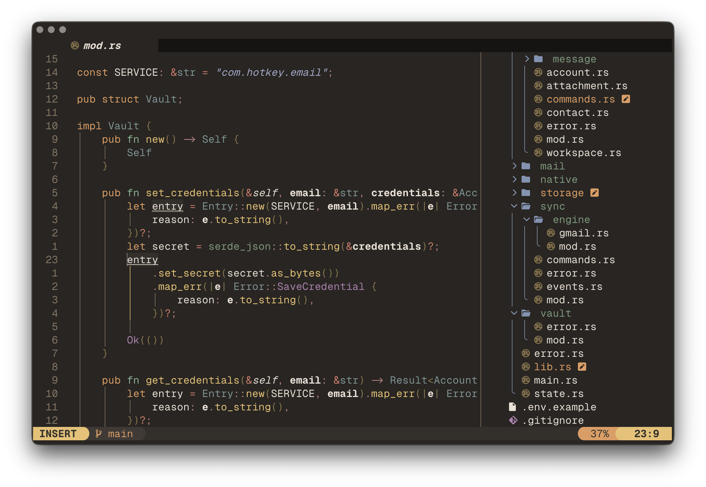

<p align="center">
    
</p>

### ⚙️ Requirements
- Nvim >= 0.9.0
- Git >= 2.19.0
- Nerd Fonts
- Lazygit (optional)

### 📦 Dependencies
- fd
- fzf
- node
- curl
- ripgrep

### ⚡ Installation

```bash
# Make a backup of your current config
mv ~/.config/nvim{,.bak}

# Clone the repo
git clone https://github.com/pauchiner/nvim ~/.config/nvim

# Start neovim!
nvim
```
